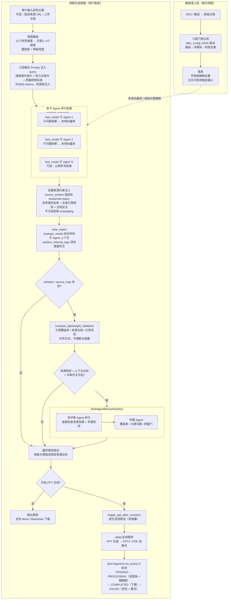

# InsightEye：让团队把"信息焦虑"转化为"决策产能"的企业洞察平台

作者：InsightEye 团队

> **TL;DR**：InsightEye 是一个面向企业研究团队的 AI 驱动洞察平台，支持多租户隔离、部门级订阅配置、全自动信息处理流水线，以及从简报到洞察报告和同步生成胶片的一站式决策材料交付。目前已服务欧洲研究院多个部门与研究所，为用户减少90%的繁重洞察工作，把团队成员的精力还给真正需要人来做的判断与创造。

---

## 一、洞察工作的真实困境

如果你做过市场洞察、产品规划、技术选型、或者任何需要对外部世界保持感知的工作，大概率遇到过这几件事。

**想找的信息，永远不在一个地方。** 产业趋势、竞品动向、行业数据，分散在官方网站、展会资料、学术数据库、行业媒体、政策文件里，横跨中英德多种语言。你花了一整天，拼出来一份"差不多"的材料——但"差不多"意味着：竞品上周更新的关键功能你没看到，某个政策征求意见稿里埋着的重要细节你没注意到。信息的覆盖范围，本质上取决于你今天搜了哪些词、碰巧打开了哪些链接，而不是这个领域里真正发生了什么。

**时效性焦虑：信息爆发与传统交付流程的错位** AI 行业的每一次黑天鹅事件都可能瞬间改变格局，友商新品发布不会提前通知，政策红利窗口期短则几周。但团队要输出一份扎实的洞察报告——从收集梳理到成稿，依然需要几个工作日。报告真正交到决策者手中时，最佳决策时机往往已悄然错过。

**信息超载与个人精力的极限对撞**  
每天源源不断涌来的内容——多语种的论文、政策、行业新闻、竞品快讯——早已超出任何个人负荷。没法全看，常规做法只能靠经验和直觉抽样浏览少数“看起来重要”的内容，在极小的样本上做判断。这不是工作态度或能力的问题，而是人类注意力的物理天花板——一个人每天精读10-15篇深度文章已属极限，可相关领域每天产出的信号远超这个数量，真正遗漏的往往才是最大的风险。

三个问题叠加在一起，指向同一个根本：**信息处理的核心动作还在靠人力逐条完成，但信息量早已超出人力能覆盖的规模**。来源分散，要靠人自己搜；内容庞杂，要靠人自己筛；报告成稿，要靠人自己写——没有自动化流水线，每次洞察都是从零开始的手工劳动，而这些精力本可以用在真正需要判断的地方。

InsightEye的出发点，正是在这里：**为团队搭建一套可配置、可追溯、持续沉淀的洞察基础设施**，让持续的信息处理从"人力密集型"转向"系统自动化"，把团队从资料搬运中解放出来，把精力还给真正需要人来做的判断与创造。

---

## 二、InsightEye 平台全貌：一条从信息入库到汇报材料的完整链路

InsightEye 是一个**AI驱动的信息洞察平台**。每个部门或研究组可以独立开通自己的洞察工作空间，成员在同一个空间内共享配置好的信息源、过滤规则和已沉淀的信息资产——既不会和其他部门的数据混在一起，也不需要每个人各自重复搭建一套信息收集流程。

信息的全生命周期在一条流水线里完成：

```TODO:替换插图
RSS 订阅源配置
    → 每日自动订阅原始文章（数百篇量级）
        → 语义过滤（三段门禁）
            → 落库存档（带来源、时间戳、相关度评分、过滤依据）
                → 研究报告生成（标准 / 深度两种模式）
                    → 幻灯片异步生成（PPTX / PDF 双格式）
```

没有任何一个现有工具把这条链完整打通：同类产品要么只覆盖前段（信息聚合与过滤），要么只覆盖后段（联网问答与报告生成），要么只做中间的知识库问答层。端到端打通意味着：信息入库的质量直接影响报告的质量；报告的结构直接驱动幻灯片的内容。各环节之间有真实的数据依赖，不是独立功能的堆砌。

用用户真实使用流程来描述平台的核心能力：

**第一步：配置你们真正关心的信息源。**
登录后，团队管理员可以把需要持续追踪的网站、学术数据库、行业媒体等RSS源逐一录入。不限数量，支持多语言来源混合配置。

**第二步：用自然语言告诉系统你关注什么。**
这也是 InsightEye 和普通 RSS 聚合工具的核心差异。你不需要写正则，也不需要维护关键词列表，只要直接描述你关心的方向。平台不是做关键词硬匹配，而是通过大模型做语义理解过滤：把真正相关的信息保留下来，把噪音内容自动过滤掉。最终你看到的是一组和你关注主题高度相关、可直接阅读和研判的信息结果；规则也可以随时调整。

**第三步：你来做最后的质量把关，也可以随时补入漏网的内容。**
平台提供了人工审核入口，对于系统预分类的内容，成员可以确认或修正类别标签——这一步是可选的，但对于核心的数据源，它确保了用户对关键内容的可控。如果发现某篇重要文章没有被自动捕获，只需粘贴文章 URL，系统会自动提取全文、接入同一套处理流程、入库归档，和自动订阅或推送进入的内容完全统一。

**第四步：从原始信息到交付材料，一键完成。**
积累的信息资产可以直接驱动两类高价值输出：

- **简报**：选定时间范围和内容范围，系统自动生成中英双语摘要报告，支持按主题聚合、按标签分类。
- **信息洞察**：输入研究主题，平台读取已入库内容及按需引入的外部材料，从中提取核心要点、关键结论与结构脉络，输出可直接阅读的结构化报告。几十至几百页原始素材由平台读完、筛完、整理好——你拿到的是去掉水分的精华，而不是更多原始文本。洞察研究聚焦于从大量材料中抓核心、抓关键、抓脉络，适合快速掌握一个方向的全貌。可同步生成文档和胶片，便于用户基于洞察信息快速进行总结和汇报。

## 三、链路能可靠运转的四个关键改进

### 关键改进1：如何利用 AI 从“只会找词”变成“懂你所想”

**朴素实现的失败**

早期信息过滤是关键词列表——用户填写"AI 芯片"、"欧盟 AI 法案"等词，系统做字符串匹配。两个不可绕过的缺陷：

第一，关键词只能捕捉你**已经想到**的词。"端侧推理加速"这个方向，会出现在"Neural Processing Unit"、"On-device LLM"、"edge inference optimization"等完全不同的表述里，更不用说跨语言的中德英混排。一套关键词列表永远只能覆盖你已经知道的表达方式，而不是这个领域里真正发生的事情。

第二，关键词无法表达复合逻辑。一个硬件团队的真实需求是："关注欧洲 AI 芯片政策，且排除消费级产品新闻，同时重点关注与我们产品线直接竞争的端侧推理方案"——任何关键词组合都无法编码这种"且/或/非"的交叉约束。

换成"让 LLM 判断每篇文章是否相关"后，精度提升了，但遇到新问题：**过滤标准只存在于 prompt 里，每次修改都是黑盒变更，无法追溯是哪一次修改改变了过滤行为**，不同研究组也无法做差异化配置。

**解法：三段门禁 + 结构化决策树**

把"判断标准"从 prompt 文本里拉出来，写进结构化的 `filter_config` JSON——变更标准等于变更配置，有版本、有审计、可对比。

过滤执行被显式拆成三个门禁：

**路由门禁**：读取 `group_config[role].filter_mode`，决定走决策树还是直通。声明了决策树但结构不合法时，自动降级为直通并记录告警——不静默失败，不中断服务。直通路径不过模型，适合不需要精过滤的研究组。

**树内规格门禁**：分类阶段、分支判定阶段、合并输出阶段，全部由 `filter_config` JSON 中的 prompt 模板驱动。可选的 `irrelevant` 块按置信度阈值丢弃低相关性文章。改变过滤标准等于修改这个 JSON，不需要动代码，变更有迹可查。

**时效与数据卫生门禁**：决策树路径按 `date_offset_days` 截断日期窗口，落库前字段级精确去重，实际删除数量在日志 `duplicate_deleted` 字段中可观测。

真实运行日志——128 篇原始文章，最终写入 12 篇：

```
[FILTER_START]  role=CI  decision_tree  total_articles=128
[FILTER_DEBUG]  role=CI  after_classify  tag_distribution={'学术':41,'政治':22,'其他':65}
[FILTER_DEBUG]  role=CI  category=学术  after_nodes=41  after_merge=17  merge_rule=any
[FILTER_DEBUG]  role=CI  irrelevant_filter  before=17  after=12  （confidence 低于阈值）
[FILTER_END]    role=CI  total_written=12  duplicate_deleted=5
```

这个漏斗的每一层都有日志记录，用户可以事后追溯"为什么今天只有 12 篇"，哪一层拦截了哪些内容，依据是什么。

```json
{
  "decision_tree": {
    "classify": { "system_prompt": "...", "user_template": "标题:{title} 正文:{text}" },
    "branches": {
      "学术": { "nodes": [{ "id": "n1", "merge_rule": "any", "system_prompt": "...", "user_template": "..." }] },
      "政治": { "nodes": [] }
    },
    "output": { "merge_categories": ["学术", "法规"] },
    "irrelevant": { "enabled": true, "min_confidence_threshold": 0.55 }
  },
  "date_offset_days": 1,
  "max_workers": 32
}
```

### 3.2 方向问题：报告生成环节由传统的内容搬运 跃迁到有方向的结构化提炼

### **朴素实现的失败**

早期版本的做法很直接：接收用户的研究问题，构建检索 query，让模型综合生成报告。对一批真实课题的输出做抽样评估后，结论很清楚：**大多数报告停在了"内容搬运"的层次，而没有做到"有方向的结构化提炼"**。"国内大模型推理成本优化主流路径"得到了一篇技术综述；"欧洲 AI 芯片监管趋势"得到了一份政策梳理。两份都"正确"，但都只是把信息重新组织了一遍——它们覆盖了"是什么"，却没有聚焦到用户实际需要的维度上。

我们试过在 system prompt 里加"请聚焦核心，而非泛泛综述"之类的指令。效果不稳定，原因很具体：**不同研究课题需要从完全不同的维度切入**——关注竞争格局的课题需要聚焦攻防路径与关键节点，政策类课题需要聚焦时间窗口与合规影响，技术选型类课题需要聚焦成熟度与替代方案，供应链类课题需要聚焦来源集中度与韧性评估。一句通用指令无法覆盖这些差异，模型会走最安全的中间路径：写一篇面面俱到但无处聚焦的综述。

**为什么这不只是提示词问题**

问题的根源在于：即使提示词语气很强，模型在没有外部维度约束的情况下，无法稳定地"切入正确的研究方向"。同一个研究问题，从"技术成熟度"维度切入和从"竞争格局"维度切入，会生成完全不同的子问题、调用完全不同的证据，产出完全不同的内容结构。这个方向的选择必须在检索**之前**做出，否则向量匹配阶段就已经走偏了。

**解法：进入检索之前，先做意图解构**

在研究课题进入检索之前，先用轻量模型做一次意图路由。这里有一个关键的设计前提需要解释：通用 AI 工具没有"研究维度"这个概念——它们把所有问题都当成同等的信息检索任务处理。InsightEye 的出发点不同：我们针对企业研究院场景梳理了 12 个专属的研究维度白名单，涵盖竞争动态（`COMPETITION_DYNAMICS`）、宏观政策扫描（`MACRO_SCAN`）、技术标准跟踪（`TECH_STANDARD`）、供应链韧性（`SUPPLY_CHAIN_RESILIENCE`）等企业研究团队日常最高频的研究角度。**这些维度在通用 AI 工具里不存在**——它们是从实际研究课题中归纳出来的，是对"企业研究人员最常需要从哪个维度切入"这个具体问题的工程回答。todo太绕了正因为有这个专属白名单，Insighteye 才能从已知框架里精准选出最匹配的 1–3 个，而不是让模型在无边界的语义空间里自由联想—— todo12个研究维度


| 研究课题         | 路由结果                                              | 置信度  |
| ------------ | ------------------------------------------------- | ---- |
| 国内大模型推理成本优化  | COMPETITION_DYNAMICS + TECH_FORESIGHT             | 0.87 |
| 欧洲 AI 芯片监管趋势 | MACRO_SCAN + TECH_STANDARD                        | 0.91 |
| 供应链替代方案评估    | SUPPLY_CHAIN_RESILIENCE + PRODUCT_COMPETITIVENESS | 0.83 |


路由结果不只是一个标签，它被展开为**三层融合 Prompt**（约 3000 tokens）：第一层是该维度的关键证据清单与结构指引，第二层是多维度选中时的关联点交织执行指令，第三层是跨维度通用的质量控制标准（证据密度、置信度标注、非共识挖掘）。这个融合 Prompt 在检索之前注入 query，让子问题拆解从一开始就走在正确的研究方向上。

效果是具体可见的。同样是"供应链风险"这个课题，无路由时子 Agent 生成的子问题是"供应链主要包含哪些环节"；有路由时生成的是"关键物料单一来源度如何"、"国产替代认证进度如何"、"地缘物流路径的备选方案有哪些"。两者的检索召回内容相差悬殊，报告的内容深度和针对性完全不同。

```python
# webpages/deep_research.py → intent_router/router.py
intent_result = await router.detect_intent(research_topic, report_type="deep_research")
# → {"selected_frameworks": ["COMPETITION_DYNAMICS", "TECH_FORESIGHT"],
#    "confidence": 0.87, "reason": "涉及竞争格局演变与技术路线选择的交叉分析"}

# 未命中白名单：静默降级为 GENERAL_RESEARCH，不注入虚假框架，不阻断流程
selected = [f for f in intent_result["selected_frameworks"] if f in FRAMEWORK_WHITELIST]

# 三层融合 Prompt：维度操作指引 + 张力点指令 + 质量控制标准
framework_prompt = router.get_writer_fusion_prompt(selected, report_type="deep_research")

# 框架约束在检索前注入；来源约束延后注入（见 3.3 节），避免污染 embedding
query = research_topic + "\n\n【分析约束】\n" + framework_prompt
```

路由错了，后面所有检索都是在错误方向上用力。这是"AI 帮你搬运原文"和"AI 帮你在正确方向上提炼核心"之间最核心的工程差距。todo：贴before after截图

---

### 3.3 来源约束问题：越早加越好的直觉是错的 todo改标题

**朴素实现的失败**

用户上传内部文档或指定来源 URL，要求报告核心结论必须来自这些材料。朴素实现：把"只引用以下来源"的约束塞进检索 query 的开头，和研究问题一起发出去。

问题很快出现：**指定的文档明明包含最相关的段落，但报告引用的是其他来源——甚至是模型幻觉出的内容**。约束加得越清楚，相关文档的召回反而越差。

**失败机制**

问题出在向量检索阶段。当"只引用 doc_A"这类约束混入 query 时，embedding 的语义重心偏移：向量空间里"只引用"、"必须来自"这类措辞，会把检索方向拉向"权限限制"、"来源声明"相关的文本片段，而不是研究主题的实质内容。结果是：语义最相关的文档段落，因 embedding 距离偏大，被排在后面甚至被截断。**来源约束的存在，反而破坏了来源被正确检索到。todo：画个图说明**

这个失败不是偶发的。从机制上看，它是可预测的：任何语义上与"来源限制"相关的词汇，都会在向量空间里干扰以"研究主题"为核心的最近邻搜索。

**解法：检索与写作，使用不同的 query**

核心洞察：**检索阶段需要干净的主题 query，来源约束只需要在写作阶段生效**。两者分时使用同一个字段，不需要额外接口——在 `conduct_research()` 完成后、`write_report()` 之前，才把来源约束追加到 `researcher.query`：

```python
researcher = GPTResearcher(
    query=query,                          # 检索阶段：只含主题 + 研究维度约束
    user_provided_source_urls=user_urls,  # 引擎侧构建 source_map 白名单
)
await researcher.conduct_research()       # 检索完成，query 不含来源约束

# 检索完成后，再追加来源约束——只对随后的 write_report 生效
if source_context:
    researcher.query += "\n" + source_context  # 含来源白名单、五条引用规则、文档完整正文

report = await researcher.write_report()
```

检索阶段"干净"，写作阶段"严格"。

引擎侧配合构建 `source_map: dict[str, str]`，将来源 URL 映射到实际内容。初稿生成后，先计算引用覆盖率并写日志（不阻断主链路）；当来源锁定条件满足时，进入 `MultiAgentReviewPipeline` 做独立评审（见 3.4 节）。对于极端合规场景，`CitationEnforcer` 提供按句扫描、缺据句尾追加 `[待核实]` 或整句置空的能力，作为可插拔插件备用，不在常规链路中启用。

---

### 3.4 质量控制问题：让模型评估自己的输出是系统性偏向

**朴素实现的失败**

生成报告后，在 prompt 里加"请检查报告质量，确认结论有来源支撑"。模型会自信地表示报告质量良好——即使报告里有明显的逻辑漏洞、无来源的结论，或者只在正文里重申了原始文档而没有任何分析，自评结果通常仍然是"结构清晰，证据充分"。

这不是偶然的。**当模型评估自己刚刚生成的内容时，它倾向于延续生成时的语义惯性，很难从外部视角发现问题**。在主观评估任务（"这份报告分析够不够深入"）上尤其严重，因为没有可以对照的二值测试。Anthropic 在 agentic coding 工作中记录过完全一致的失败模式："agents tend to respond by confidently praising the work—even when, to a human observer, the quality is obviously mediocre."

**解法：分离生成者与评审者**

核心洞察：**模型天然倾向于认可与自己语义风格相近的内容——这意味着它审查自己刚刚生成的报告时，最难发现的恰恰是最需要发现的问题**。把写报告和审报告拆成两个独立的 Agent，审查者不需要为自己的产出辩护，偏见的来源才被切断。调优一个独立的挑剔评审者，远比要求生成者自我批判更容易收敛。

InsightEye 的 `MultiAgentReviewPipeline` 在来源锁定模式开启且上下文规模达标时自动触发。评审 Agent 独立执行：逐段检查结论是否有对应来源支撑；来源间存在矛盾时，检查报告是否如实记录分歧而非主观合并；对引用覆盖率低于阈值的段落，判断是改写正文还是附加人工复核提示。

"先快后精"分层控制成本与延迟：轻量校验（`compute_lightweight_validation`）先计算指标并写日志，不阻断主链路；只有满足条件时，才进入完整仲裁流程：

```python
# 引擎侧：report_generation.generate_report
whitelist, source_map = _build_source_evidence_from_context(context, doc_path, user_whitelist)

report = await create_chat_completion(...)
report = sanitize_internal_tags(report)   # 清洗模型内部标注遗留物

# 轻量校验：仅写日志，不阻断主链路
if report and (whitelist or source_map):
    validation = compute_lightweight_validation(report, whitelist, source_map)

# 完整仲裁：来源锁定 + 评审开关开启 + 上下文规模达标时触发
if report and is_source_locked_evidence and _get_review_committee_enabled() and context_has_substance:
    if source_map:
        pipeline = MultiAgentReviewPipeline(source_whitelist=whitelist, ...)
        result = await asyncio.wait_for(
            pipeline.run(report=report, evidence=source_map),
            timeout=review_timeout,   # 60–600 秒，超时则附加 ⚠️ 人工复核提示
        )
```

评审者在早期版本里也偏宽松——和生成者一样，它也是 LLM，天然倾向对 LLM 输出友好。调优评审者比调优生成者更容易：在 prompt 里显式要求"挑剔立场"，并用少量典型反例做 few-shot 标定。几轮迭代后，评审者的判断与人工预期趋于一致。

`source_map` 绑定是代码层面的约束，不依赖模型"自觉"。独立评审是流程层面的约束，不依赖单一模型的内省能力。两者叠加，才真正压缩了"AI 说得自信但没有根据"的概率空间。

---

### 全链路的执行骨架 todo：核心改进节点标红

数据准入与洞察生成两个层次，串联成一条完整的从信息入库到研究报告交付的执行链。




> **[视频占位符]**
> 30 秒端到端演示录屏
> 内容：配置 Filter → 查看今日信息 → 触发深度研究 → PPT 异步生成 → 状态变为 COMPLETED → 下载 PPTX

---

## 四、用数字衡量节省

节省发生在哪几个环节，节省量级如何：


| 工作环节       | 传统人工耗时        | InsightEye 耗时          |
| ---------- | ------------- | ---------------------- |
| 来源识别与内容收集  | 每次从头搜索，半天至一天  | 订阅流水线每日更新，按需取用         |
| 相关内容筛选     | 逐条人工判断，数小时    | 过滤执行，分钟级完成             |
| 文献阅读与子问题梳理 | 2–3 个工作日      | 多子 Agent 并行，约 15–20 分钟 |
| 结构化报告撰写    | 3–5 个工作日      | 综合模型写作，约 10–15 分钟      |
| 幻灯片制作      | 1–2 个工作日      | 异步渲染，15–30 分钟          |
| **合计**     | **8–12 个工作日** | **报告到 PPT 全程 < 1 小时**  |


节省的是整理与转写，不是判断。报告交到团队手中时，研究人员还需要阅读报告、对结论提出追问、根据自己的领域判断决定如何使用这些信息。平台做的是把几百页原始材料压缩成可以真正使用的结构化精华——剩下的判断，还是由人来做。

信息覆盖方面：研究人员在高效状态下每天能处理的有效文章约在 10–20 篇之间，这是注意力带宽的物理天花板。InsightEye 配置的信息源不设数量上限，支持中英德多语言混合，每日抓取候选文章规模在数百篇量级。以实际运行数据为例：某研究组单日 128 篇原始候选，经三段门禁过滤后写入 12 篇高相关内容，其中包含若靠人工抽样大概率会遗漏的关键外文信源。这不是"更快地做同样的事"，而是系统覆盖了人力根本无法覆盖的范围。

单次深度研究报告的模型调用成本在 $0.0x 量级。

---

## 五、一个贯穿始终的设计原则

回顾这四个决策，失败的模式是一样的：**把本该由人来定义的"规格"，交给了模型来生成**。

- 把过滤标准写进 prompt 文本 → 标准每次不一样，不可追溯
- 把报告角度完全交给模型决定 → 输出最安全的中间路径
- 让生成者自评输出质量 → 系统性偏乐观
- 把来源约束和研究主题一起注入 → embedding 被干扰，违反直觉

每次失败之后，架构里增加了一个新的约束：

```
朴素 LLM 调用        → 质量不稳定      → 引入 filter_config 结构化规格
单 query 检索        → 方向跑偏        → 引入意图路由白名单
来源约束混入 query    → 召回质量下降    → 引入分时注入
单模型自评           → 系统性偏乐观    → 引入独立评审 Agent
```

每一条约束都在回答同一个问题：**这个位置的判断，可以安全地交给模型执行，还是必须由人来先定义规格？**

模型非常擅长执行一个定义清楚的规格。但在没有外部约束的空间里，模型会走最安全、最平庸的路径——这不是模型的问题，而是"规格没有被定义"的问题。AI 把实现的成本压到接近零，让"把规格定义清楚"这件事的相对重要性急剧上升。

InsightEye 的架构不是提前设计好的，是从最简单可用的版本出发，每次真实失败后增加一个新的约束长出来的。目前平台已在欧洲研究院多个部门日常运转，下一步目标是推广到整个欧洲研究院。

如果你所在的团队也在面对类似的问题——信息量超出人力处理范围、核心结论难以从原始材料中提炼、洞察报告每次都要从头做——欢迎来试试 InsightEye。

---

*InsightEye 目前已服务欧洲研究院多个部门与研究所。感谢各研究组的真实使用场景和反馈，是这些问题驱动了上述每一个架构决策。*
